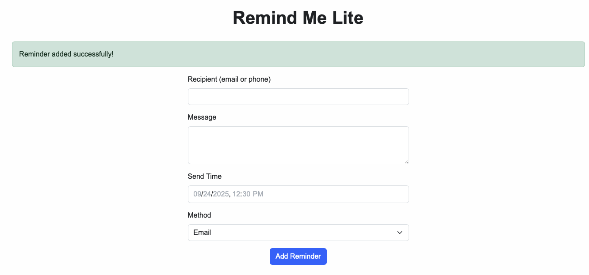
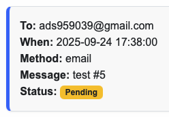
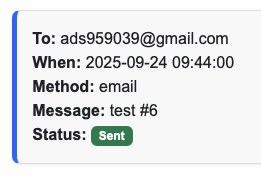
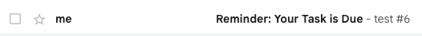
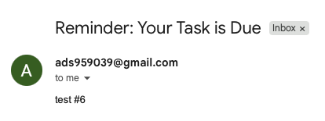

# Remind Me Lite

A simple, polished tool that lets users schedule one-time reminders via email.  
Ideal for personal productivity, small teams, solo founders, or client-facing use cases where simple scheduling is all that’s needed — no logins, no distractions.

---

## Features

- Schedule one-time **email reminders**
- Choose **custom date and time**
- Automatic **timezone detection**
- Clean UI with status labels for **Sent / Pending**
- Works seamlessly on desktop and mobile

---

## Demo

🚀 **Live App**  
👉 [Remind Me Lite on Render →](https://)

### 1. Add a Reminder

- Enter email, message, and desired time
- App automatically detects your timezone offset

---

### 2. View Scheduled Reminder (Pending or Sent)

- You’ll see all reminders you’ve added
- Status badge shows whether it was sent or is still pending

---

### 3. Receive Your Email

- You’ll receive a real email at the scheduled time
- Works reliably using Gmail SMTP backend

---

## Freelance Use Case

Great for clients who need:

- A basic notification system
- One-time scheduling for emails (appointments, self-reminders, etc.)
- A lightweight tool with no authentication overhead

---

## Built With

- Flask (Python web framework)
- SQLite (local DB)
- Gmail SMTP (for sending emails)
- Bootstrap 5 (styling)

---

## No Signup Needed

Users don’t need to register or log in. The tool is intentionally simple — enter info, get reminded. That’s it.

---

## License

Personal portfolio and demonstration use only. Not open for contributions or cloning.

---